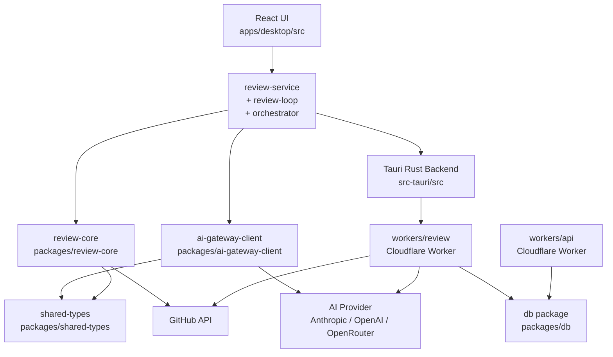

<!-- generated-by: gsd-doc-writer -->
# Architecture

## System Overview

CodeVetter is a macOS desktop application for AI-driven code review of agent-generated code. It accepts a local git diff or a GitHub pull request as input and produces a scored findings report plus optional inline PR comments as output. The architectural style is a Tauri desktop shell (Rust backend + React/Vite webview frontend) with a companion set of shared TypeScript packages used by both the desktop app and a pair of Cloudflare Workers that handle GitHub App webhooks for automated PR review.

---

## Component Diagram



---

## Data Flow

### Local diff review (primary path)

1. The user opens the **QuickReview** or **Workspaces** page in the React UI (`apps/desktop/src/pages/`).
2. The UI calls `reviewLocalDiff()` in `review-service.ts`, passing a repo path and config.
3. `review-service` calls the Tauri IPC command `get_local_diff` (Rust: `commands/review.rs`), which shells out to `git diff` and returns the patch text plus changed file list.
4. `review-service` constructs a `GatewayReviewRequest` (typed in `packages/shared-types`) and passes it to `AIGatewayClient.reviewDiff()` (`packages/ai-gateway-client`).
5. `ai-gateway-client` calls the configured AI provider (Anthropic, OpenAI, or OpenRouter) via an OpenAI-compatible chat completions endpoint, injecting a structured prompt built by `packages/review-core/src/prompt.ts`.
6. The raw JSON response is parsed back into `ReviewFinding[]`. `review-core` computes a composite score (0–100) via `computeScore()` and a stable fingerprint per finding via `computeFindingFingerprint()`.
7. Results are saved to the local SQLite database via the Tauri IPC command `save_review` (Rust: `commands/review.rs`).
8. The UI renders findings through `finding-card.tsx`, `score-badge.tsx`, and `merged-review.tsx`.

### Review feedback loop (agent orchestration path)

1. When a task on the Kanban board (`pages/Agents.tsx`) moves to the "Review" column, `review-loop.ts` calls `startReviewLoop()`.
2. The loop runs `reviewLocalDiff()` (or `reviewPullRequest()` if a workspace has a linked PR).
3. If `score < 80`, `review-loop.ts` builds a fix prompt from findings and calls the Tauri IPC command `launch_agent` to spawn a `claude-code` or `codex` agent subprocess.
4. `agent_monitor.rs` polls running agent PIDs; `git_watcher.rs` polls for new commits from the agent. When the agent finishes, the task returns to "Review" and the loop iterates (max 3 attempts).
5. On pass or exhaustion, the task status is updated to "done" via `update_task` IPC.

### GitHub App webhook path (serverless)

1. A GitHub `pull_request` event hits `workers/review` (`/webhook` endpoint).
2. The worker verifies the HMAC signature, inserts a `review_job` row into Cloudflare D1 via the `packages/db` control-plane helpers, and returns HTTP 202.
3. The Cloudflare scheduled trigger fires every few seconds, pulls queued jobs via `D1QueueAdapter`, and dispatches them to `handleJob()` in `workers/review/src/handlers.ts`.
4. The handler fetches the PR diff from GitHub, calls the AI gateway, and posts inline review comments back to GitHub using `packages/review-core/src/github.ts`.

---

## Key Abstractions

| Abstraction | File | Purpose |
|---|---|---|
| `AIGatewayClient` | `packages/ai-gateway-client/src/index.ts` | Single-method wrapper that calls any OpenAI-compatible endpoint |
| `AgentAdapter` interface | `packages/shared-types/src/agent.ts` | Contract for pluggable agent backends (Claude Code, Codex) |
| `ReviewFinding` type | `packages/shared-types/src/review.ts` | Core finding shape: severity, title, summary, filePath, line |
| `GatewayReviewRequest/Response` | `packages/shared-types/src/gateway.ts` | Input/output contract between review-service and ai-gateway-client |
| `computeScore()` | `packages/review-core/src/scoring.ts` | Weighted penalty model → composite 0–100 score |
| `computeFindingFingerprint()` | `packages/review-core/src/scoring.ts` | Stable hash for deduplicating findings across re-reviews |
| `buildPrompt()` / `parseReviewResponse()` | `packages/review-core/src/prompt.ts` | Structured prompt construction and JSON response parsing |
| `reviewLocalDiff()` / `reviewPullRequest()` | `apps/desktop/src/lib/review-service.ts` | Orchestrates the diff → AI → score → save pipeline |
| `startReviewLoop()` / `continueReviewLoop()` | `apps/desktop/src/lib/review-loop.ts` | Agent feedback loop: review → fix → re-review cycle |
| `startOrchestration()` | `apps/desktop/src/lib/orchestrator.ts` | Multi-step workflow runner (plan → code → review) |
| `DbState` | `apps/desktop/src-tauri/src/main.rs` | Arc-wrapped SQLite connection shared across Tauri commands |
| `createControlPlaneDatabase()` | `packages/db/src/index.ts` | Factory for the D1-backed control-plane used by workers |

---

## Directory Structure Rationale

```
CodeVetter/
├── apps/
│   ├── desktop/          # Primary product — Tauri + React desktop app
│   │   ├── src/          # React/TypeScript frontend (pages, components, lib)
│   │   └── src-tauri/    # Rust Tauri backend (IPC commands, SQLite, agents)
│   ├── landing-page/     # Next.js marketing site, deployed to Vercel
│   └── dashboard/        # Next.js web dashboard (on hold)
│
├── packages/             # Shared library code consumed by apps and workers
│   ├── review-core/      # Review engine: prompts, scoring, GitHub API, semantic dedup
│   ├── ai-gateway-client/# Thin OpenAI-compatible HTTP client
│   ├── shared-types/     # TypeScript types shared across all workspaces
│   └── db/               # D1/SQLite control-plane schema, migrations, query helpers
│
├── workers/              # Cloudflare Workers (edge, serverless)
│   ├── review/           # GitHub App webhook receiver + async review job processor
│   └── api/              # REST API worker (on hold)
│
└── docs/                 # Project documentation and architecture records
```

**Why this layout:** The monorepo separates concerns by deployment target. `packages/` contains all pure TypeScript logic with no runtime assumptions, making it safe to import in both the browser webview (desktop app) and Node-less Cloudflare Workers. `apps/desktop` is the only workspace that depends on Tauri APIs; `workers/` is the only workspace that depends on Cloudflare primitives. This boundary prevents accidental coupling between desktop-only and edge-only APIs.
